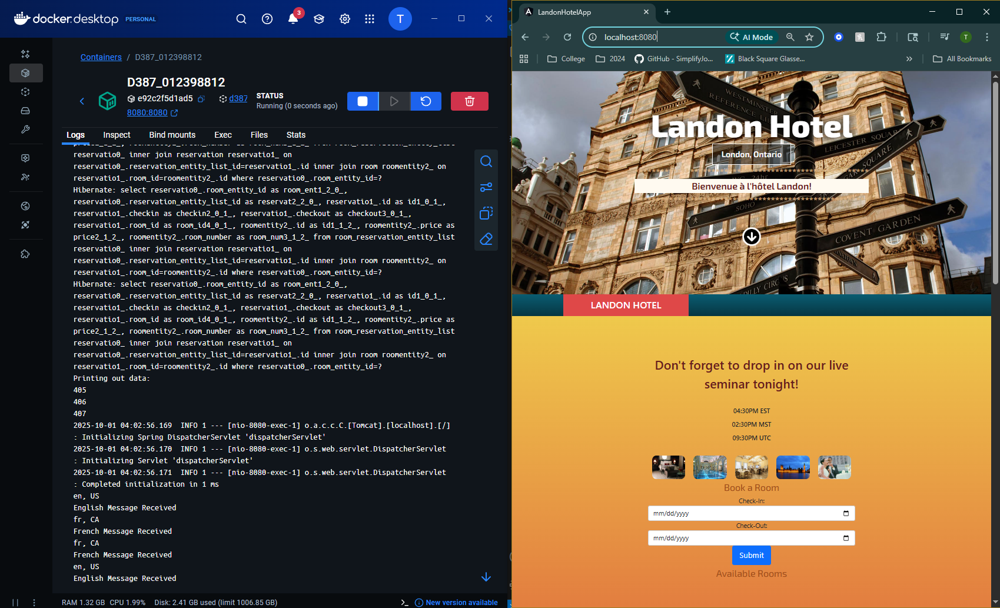

B1 : Created Resource bundles for English and Candian French
- made a packager folder called “container” to hold changes
- created MessageDisplayer to display the message
- created a controller for it called Welcome controller
- added a header using ngFOR to display the welcomes on the frontpage
- alterations made to app.component

B2: Modified display prices of reservation to show all needed currencies

B3: Added features for all timezones and made sure that message for live seminar shows on main screen.
- Controller made for time conversion in container package/folder
- created need methods via html, ts / app.component files
- stylistic tweaks to the time being showned on main stream

C1: Created a Dockerfile for the purpose of image usage

C2: Picture of the application running from a container

C3: How I would deploy to the cloud
1. First, I would decide on whether I would use AWS or Azure as my cloud provider.
2. After deciding on Azure as my cloud provider I would setup up a container App.
3. After creating the necessary groups and names I would make sure my image source
is from Docker Hub.
4. Afterwards I would deploy the container instance from Azure to make sure that its live and working.